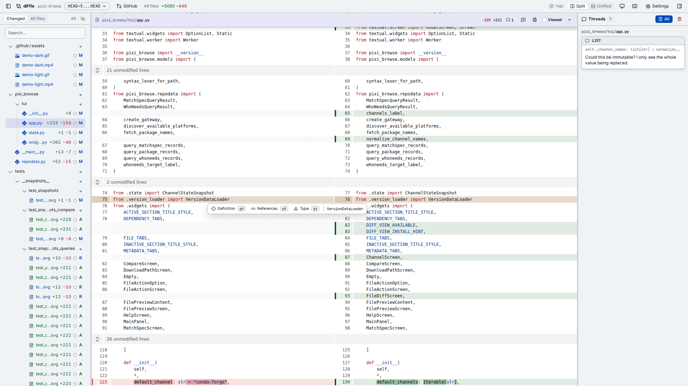

# diffle

[](https://github.com/moritzwilksch/diffle/actions/workflows/ci.yml)
[](https://prefix.dev/channels/conda-forge/packages/diffle)
[](https://prefix.dev/channels/conda-forge/packages/diffle)
[](https://www.npmjs.com/package/@moritzwilksch/diffle)

Review a git diff in the browser, comment on lines or blocks, then copy the
comments as a prompt for an agent.

<picture>
  <source media="(prefers-color-scheme: dark)" srcset=".github/assets/diffle-dark.png">
  <source media="(prefers-color-scheme: light)" srcset=".github/assets/diffle-light.png">
  
</picture>

## Installation

From [conda-forge](https://prefix.dev/channels/conda-forge/packages/diffle):

```bash
pixi global install diffle
```

Or from [npm](https://npmx.dev/package/@moritzwilksch/diffle):

```bash
npm install -g @moritzwilksch/diffle
```

To run it without installing anything:

```bash
pixi exec diffle working
npx @moritzwilksch/diffle working
```

## Usage

```bash
diffle working          # HEAD vs worktree: staged, unstaged, untracked
diffle develop          # merge-base(develop, HEAD) vs HEAD: what this branch added
diffle pr 27            # GitHub PR 27, or its url; without a number, this branch's PR
diffle main..feat       # any git-diff revspec: <rev> | a..b | a...b | a b
diffle main..worktree   # "worktree" names the uncommitted tree on either side
diffle working --no-lsp # skip the language servers for this run
diffle --help           # list all commands and flags
```

`diffle pr` needs an authenticated [`gh`](https://cli.github.com/). Foreign PR URLs open in a temporary clone, leaving your local repository untouched.

Closing the last browser tab that diffle opened stops the server and prints open comments to stdout. Pass `--keep-alive` to keep it running, or use `--no-open` and press Ctrl+C when done.

Comments persist in `<git-dir>/diffle/comments.json` and never touch the worktree. They follow changed text where possible and become stale when their text leaves the diff.

Generated files and files matching auto-viewed globs start collapsed. There are no globs by default; configure them in settings or with `diffle config`.

## Shortcuts

- `j` / `k`: next or previous line (`10j` / `10k`: ten lines down or up)
- `J` / `K`: next or previous file
- `]` / `[`: next or previous hunk
- `c`: comment
- `R`: resolve
- `V`: select a block
- `v`: mark viewed
- `/`: search the current file
- `g/`: search the diff or codebase
- `gf`: filter files
- `yy`: copy all comments
- `F`: open the full file
- `Ctrl+o`: go back

Press `?` in the app for the full list.

## GitHub reviews

Use the pull request icon to add one thread or all open threads to a pending GitHub review — a new one, or the pending review already waiting on the pull request. This requires a local, authenticated [`gh`](https://cli.github.com/).

Nothing is submitted for you: open the pull request on GitHub and submit the review yourself, so you can edit or drop comments first.

Posting works for `pr` on the checked-out branch, or any revspec ending at HEAD on a pushed branch. GitHub cannot anchor comments from `working` because those lines are not committed. Stale threads are skipped.

Exported comments carry a hidden thread ID. Adding the same thread again at the same lines leaves its comment alone, or rewrites it when you edited the thread. Other drafts, including exports from older versions without an ID, stay untouched. The button says Added, Updated, or Already added.

If the pending review cannot be read completely, export stops before changing it. Reviews with more than 1,000 threads exceed the lookup limit.

## Language servers

Definitions, references, hover details, and symbol search come from a language server. diffle looks for one on `PATH` for every language in the diff and starts it for the run:

- `gd` or Command/Ctrl+click: definition
- `gy`: type definition
- `gA`: references
- `gs` / `gS`: file or repository symbols

A result outside the diff's files, such as the standard library, `site-packages`, or an ignored virtualenv, opens read-only: no comments, no further navigation.

`diffle lsp` prints what each language would get, and what to install for the ones it cannot serve:

```
python    pyrefly lsp
rust      not on PATH (tried rust-analyzer)
```

Languages served out of the box: C/C++ (`clangd`), Go (`gopls`), Haskell, Java, JavaScript/TypeScript (`typescript-language-server`, `vtsls`), Lua, Nix, OCaml, PHP, Python (`pyrefly`, `ty`, `basedpyright`, `pyright`, `pylsp`, `jedi`), Ruby, Rust (`rust-analyzer`), shell, Swift, Terraform, Zig.

A client-side Tree-sitter worker suppresses hover and symbol menus on reserved keywords and in comments and string text; identifiers, including keyword spellings used as property names, and interpolated expressions remain actionable. Grammars load on demand. Haskell, Nix, Terraform, files over one million UTF-16 code units, and parser failures fall back to language-server behavior.

Override a command, or turn one language off with an empty command:

```bash
diffle config set-lsp rust "rust-analyzer"       # persistent
diffle config set-lsp java ""                    # never start one for java
diffle config unset-lsp rust                     # back to PATH
diffle working --lsp python="pyrefly lsp"        # this run only, repeatable
diffle working --no-lsp                          # no language server at all
```

Only the languages diffle finds in the changed files get a server; a language named by `--lsp` starts whether the diff holds it or not.

For large repositories, raise pyrefly's indexing limit:

```bash
diffle config set-lsp python "pyrefly lsp --indexing-mode lazy-blocking --workspace-indexing-limit 20000"
```

For an `src/` layout, add this to `pyproject.toml`:

```toml
[tool.pyrefly]
search-path = ["src"]
```

## Security

Every language-server command runs through a shell inside the repository and can read anything available to your user — the ones found on `PATH` as much as the ones you configure. `--no-lsp` starts none.

## Development

```bash
npm install
npm run dev -- working
npm test && npm run typecheck && npm run build
```

`npm run dev` builds the client, then starts the server from source. Restart it after client changes; the server always serves `dist/client`.

See [AGENTS.md](AGENTS.md) for repository notes.

## Acknowledgements

This workflow and tool were inspired by [difit](https://github.com/yoshiko-pg/difit).
