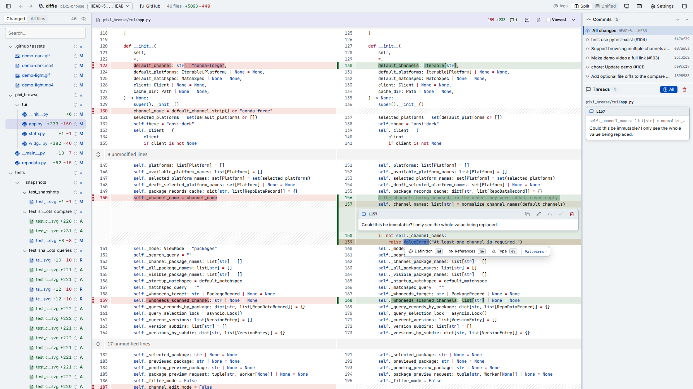

# diffle

[](https://github.com/moritzwilksch/diffle/actions/workflows/ci.yml)
[](https://prefix.dev/channels/conda-forge/packages/diffle)
[](https://prefix.dev/channels/conda-forge/packages/diffle)
[](https://npmx.dev/package/@moritzwilksch/diffle)
[](https://diffle.app)

Review a Git diff in the browser and comment on lines, blocks, or whole files. Then hand the
comments to an agent as a prompt, or to GitHub as a pending review.

<picture>
  <source media="(prefers-color-scheme: dark)" srcset=".github/assets/diffle-dark.png">
  <source media="(prefers-color-scheme: light)" srcset=".github/assets/diffle-light.png">
  
</picture>

## Install

```bash
pixi global install diffle               # conda-forge
npm install -g @moritzwilksch/diffle     # npm
```

Or grab the standalone binary, which needs no Node.js. On Linux (x64, arm64, glibc) and Apple
silicon macOS:

```bash
curl -fsSL https://diffle.app/install.sh | sh
```

It installs to `~/.local/bin`. Set `DIFFLE_INSTALL_DIR` to change that, or `DIFFLE_VERSION=v0.1.9`
to pin a release. On Windows (x64, arm64), from PowerShell:

```powershell
irm https://diffle.app/install.ps1 | iex
```

To try it without installing:

```bash
pixi exec diffle working
npx @moritzwilksch/diffle working
nix run github:moritzwilksch/diffle -- working
```

The Nix package bundles `gh`; `#minimal` drops it, and `#web`, `#rust`, and `#python` bundle
language servers.

## Pick what to review

```bash
diffle                  # HEAD vs worktree, like a bare `git diff`
diffle working          # HEAD vs worktree: staged, unstaged, untracked
diffle develop          # what this branch added since it left develop
diffle pr 27            # GitHub PR 27, or its URL; without a number, this branch's PR
diffle show a1b2c3d     # one commit, like `git show`
diffle main..feat       # any git-diff revspec: <rev> | a..b | a...b | a b
diffle main..worktree   # "worktree" names the uncommitted tree on either side
diffle --help           # all commands and flags
```

`diffle pr` needs a [GitHub token](#send-comments-to-github). A PR from another repository opens
in a temporary clone.

Closing the last diffle tab stops the server and prints your open comments. Pass `--keep-alive`
to keep it running.

## Review

- `j` / `k`: next or previous line (`10j`: ten lines down)
- `J` / `K`: next or previous file
- `]` / `[`: next or previous hunk
- `c`: comment
- `C`: comment on the whole file
- `V`: select a block
- `R`: resolve
- `v`: mark viewed
- `/`: search the current file
- `g/`: search all changed files
- `gf`: filter files
- `F`: open the full file
- `Ctrl+o`: go back
- `yy`: copy all comments

Press `?` for the full list.

A comparison lists its commits above the threads. Pick one, or step with `<` and `>`, to see
that commit alone; **All changes** returns to the whole range. Comments on a focused commit
belong to that commit, as in `diffle show`.

Comments live in `<git-dir>/diffle/` and never touch your worktree. They follow their text as
the code changes and go stale once it leaves the diff.

Generated files start collapsed, as on GitHub: `linguist-generated` in `.gitattributes` marks
them, and `linguist-generated=false` opts a file out. To collapse other files, add auto-viewed
globs in settings or with `diffle config`.

## Send comments to GitHub

The pull request icon adds one thread, or all open threads, to a pending review on the PR.
diffle never submits it: you edit, drop, and submit the comments on GitHub yourself. Adding a
thread again updates its comment instead of duplicating it.

Export works when the comparison matches the PR's committed diff, so unpushed commits and
worktree changes rule it out. Stale threads are skipped.

diffle takes the token from `GITHUB_TOKEN`, then `GH_TOKEN`, then a signed-in
[`gh`](https://cli.github.com/). Without one, everything except GitHub still works.
`GITHUB_API_URL` points diffle at another GitHub API, as in Actions.

## Jump to definitions

diffle starts a language server for each language in the diff, if it finds one on `PATH`:

- `gd` or Ctrl/Cmd+click: definition
- `gy`: type definition
- `gA`: references
- `gs` / `gS`: file or repository symbols
- `gh`: hover, including schema docs for JSON, YAML, and TOML

Results outside the diff, such as the standard library, open read-only. Large repositories can
take a while to index.

`diffle lsp` shows which server each language gets and what to install for the rest:

```
python    pyrefly lsp
rust      not on PATH (tried rust-analyzer)
```

Override a server or turn one off:

```bash
diffle config set-lsp rust "rust-analyzer"       # persistent
diffle config set-lsp java ""                    # never start one for java
diffle config unset-lsp rust                     # back to PATH
diffle working --lsp python="pyrefly lsp"        # this run only
diffle working --no-lsp                          # none at all
```

Language servers run through a shell inside the repository and can read anything your user can.
`--no-lsp` starts none.

## Shell completions

```bash
diffle completion --shell bash > ~/.local/share/bash-completion/completions/diffle
diffle completion --shell zsh > ~/.local/share/zsh/site-functions/_diffle   # on fpath, before compinit
diffle completion --shell fish > ~/.config/fish/completions/diffle.fish
```

Rerun after upgrading to pick up new commands. Revisions don't complete.

## Behind a reverse proxy

diffle works under a path prefix such as `https://proxy.example/diffle/` with no extra setting.
Have the proxy strip the prefix, including for WebSocket upgrades at `/diffle/ws`, and trust its
public origin:

```bash
diffle working -H 0.0.0.0 --no-open --allowed-origin https://proxy.example
```

If the proxy rewrites Host and Origin to its upstream address, such as a Kubernetes service
name, trust that address instead. A rejected request gets a 403 naming the header that failed.

## Development

```bash
npm install
npm run dev -- working
npm test && npm run typecheck && npm run build
```

Restart `npm run dev` after client changes; the server serves `dist/client`.
`npm run fixture -- <dir>` builds the repository the tests review, covering renames, binaries,
CRLF, and more. Screenshot tests run in Docker so they match CI:

```bash
npm run test:e2e:docker                  # the browser suite
npm run test:e2e:docker -- -g search     # matching scenarios
npm run test:e2e:report                  # open the last report
npm run test:e2e:docker:update           # accept new screenshots
```

See [AGENTS.md](AGENTS.md) for more.

## Acknowledgements

diffle is inspired by [difit](https://github.com/yoshiko-pg/difit).
Diffs are rendered with [@pierre/diffs](https://github.com/pierrecomputer/pierre).
