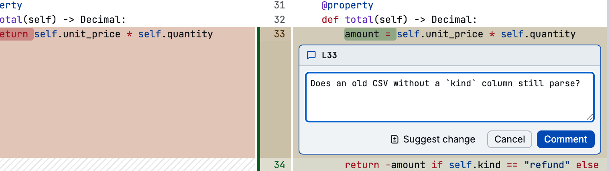

## Install

```bash
pixi global install diffle               # conda-forge
npm install -g @moritzwilksch/diffle     # npm
```

The standalone binary needs no Node.js. On Linux (x64, arm64, glibc) and Apple silicon macOS:

```bash
curl -fsSL https://diffle.app/install.sh | sh
```

It installs to `~/.local/bin`. Set `DIFFLE_INSTALL_DIR` to install somewhere else, or
`DIFFLE_VERSION=v0.1.9` to pin a release. On Windows (x64, arm64), from PowerShell:

```powershell
irm https://diffle.app/install.ps1 | iex
```

To try it without installing:

```bash
pixi exec diffle working
npx @moritzwilksch/diffle working
nix run github:moritzwilksch/diffle -- working
```

The Nix package bundles `gh`. `#minimal` leaves it out, and `#web`, `#rust`, and `#python` bundle
language servers.

## Open a review

Run diffle inside a Git repository:

```bash
diffle              # your uncommitted changes
diffle main         # what this branch added since it left main
diffle pr 27        # GitHub pull request 27
```

diffle starts a local server and opens the review in your browser. Status messages go to stderr.
[Choosing a comparison](./guides/choosing-a-comparison.md) covers everything diffle can compare.

## Read the diff

`j` and `k` move line by line, `J` and `K` jump between files, and `]` and `[` jump between hunks.
Press `v` to mark a file viewed: it collapses, and the cursor moves on to the next unviewed file.
`?` shows every shortcut.

## Comment

Put the cursor on a line and press `c`, or click a line number. Drag across line numbers, or press
`V` and extend the selection with `j` and `k`, to comment on a block. `C` comments on the whole
file.



Comments are Markdown. **Suggest change** inserts a `suggestion` block prefilled with the selected
lines; edit it into the code you want. See [Threads](./guides/threads.md).

## Hand off

Close the last diffle tab. diffle stops and prints your open comments to stdout as a prompt, so you
can pass it straight to an agent:

```bash
claude "$(diffle)"
```

Or press `yy` at any time to copy the same prompt. [Agent hand-off](./guides/agent-handoff.md)
shows the format, and [GitHub](./guides/github.md) explains how to send the comments to a pull
request instead.
