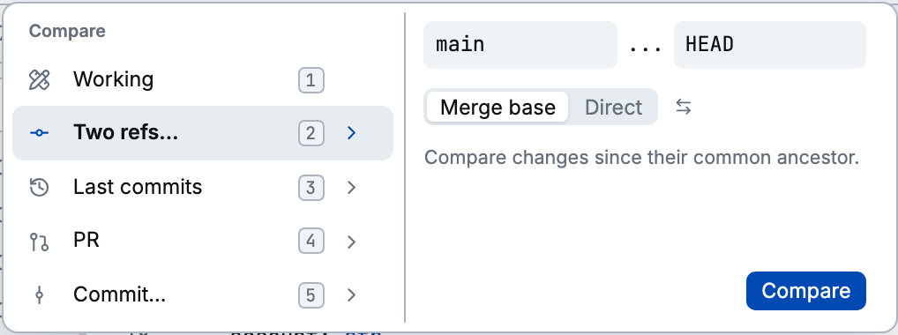
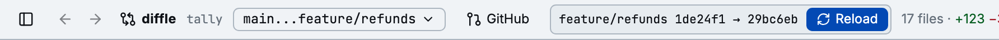

A comparison is the old side and the new side that diffle diffs. You choose it when you start
diffle, and you can switch to another one at any time with the mode picker (`m`).

## From the command line

```bash
diffle                  # HEAD vs worktree, like a bare `git diff`
diffle working          # the same: staged, unstaged, and untracked changes
diffle develop          # what this branch added since it left develop
diffle HEAD~3           # the last three commits
diffle main..feat       # main vs feat
diffle main...feat      # what feat added since it left main
diffle main..worktree   # main vs your uncommitted tree
diffle show a1b2c3d     # one commit against its first parent, like `git show`
diffle a1b2c3d^!        # the same
diffle pr 27            # GitHub pull request 27, or its URL
diffle pr               # the pull request for the current branch
```

Revisions follow `git diff`, with one exception: a lone revision compares from the **merge base**,
so `diffle main` means `main...HEAD`, not `main..HEAD`. `worktree` names your uncommitted tree and
works on either side of `..` or `...`.

`diffle pr` needs a [GitHub token](./github.md#tokens). A pull request from another repository opens
in a temporary clone.

`-C <path>` runs diffle as if it were started in `<path>`. [CLI](../reference/cli.md) lists every
flag.

## With the mode picker

Click the comparison in the header, or press `m`, to open the picker. Choose an entry with the mouse
or with `1` to `5`.



| Entry            | Compares                                                                                                                                    | CLI equivalent                |
| ---------------- | ------------------------------------------------------------------------------------------------------------------------------------------- | ----------------------------- |
| **Working**      | `HEAD` against your worktree.                                                                                                               | `diffle working`              |
| **Two refs…**    | Any two refs. **Merge base** shows what the target added since the two diverged; **Direct** compares them as they are. `x` swaps the sides. | `diffle a...b`, `diffle a..b` |
| **Last commits** | `HEAD~<base>` against `HEAD~<target>`. The defaults, 1 and 0, show the last commit.                                                         | `diffle HEAD~3`               |
| **PR**           | A pull request by number or URL. Leave the field empty for the current branch's pull request.                                               | `diffle pr 27`                |
| **Commit…**      | One commit against its first parent, with a preview of its message.                                                                         | `diffle show <rev>`           |

Each comparison keeps its own [comments](./threads.md) and viewed marks, so switching away and back
loses nothing.

## When the compared refs move

A **worktree** comparison follows your edits: save a file and the diff updates.

A comparison **between refs** can change under you too, when you commit, rebase, or fetch a new
push. diffle doesn't swap the review out from under you. It shows which end moved and offers
**Reload**:



Press `r` or click **Reload** to recompute the review at the new commits. Your viewed marks carry
over, and each reload records a new [iteration](./iterations.md).

The **Reload behavior** setting changes this:

- **Always**: recompute as soon as a ref moves, the way a worktree review follows edits.
- **Auto** (default): wait for Reload when an endpoint is a branch; recompute at once for a detached
  `HEAD`, a tag, or an expression like `HEAD~2`.
- **Never**: always wait for Reload.

A single commit (`diffle show`) never moves. `--no-watch` turns watching off altogether.
