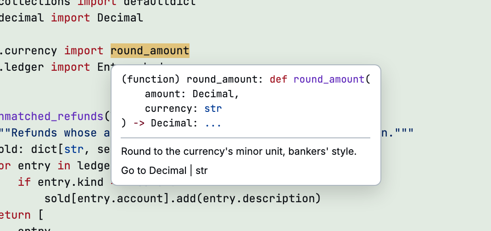

diffle starts a language server for each language in the diff, if it finds one on `PATH`. You get
definitions, references, symbols, and hover docs while you review, without opening an editor.

<picture>
  <source media="(prefers-color-scheme: dark)" srcset="../assets/lsp-hover-dark.png">
  <source media="(prefers-color-scheme: light)" srcset="../assets/lsp-hover-light.png">
  
</picture>

## Use it

| Keys                    | Action                                                             |
| ----------------------- | ------------------------------------------------------------------ |
| Hover a symbol, or `gh` | Signature and docs, including schema docs for JSON, YAML, and TOML |
| Click a symbol          | A popover with definition, type definition, and references         |
| `gd`, or ⌘/Ctrl+click   | Go to the definition                                               |
| `gy`                    | Go to the definition of the symbol's type                          |
| `gA`                    | List references: `j`/`k` and Enter to jump, `n`/`N` to step        |
| `gs` / `gS`             | Symbols in the current file / across the repository                |
| `Ctrl+o` / `Ctrl+i`     | Jump back / forward                                                |

Results outside the diff, such as the standard library, open read-only.

Language servers read your checkout, so navigation works when the new side is your worktree or the
checked-out commit. Large repositories can take a while to index; the header shows each server's
status and its log.

## Which server runs

`diffle lsp` shows which server each language gets, and what to install for the rest:

```
python    pyrefly lsp
rust      not on PATH (tried rust-analyzer)
```

For each language, diffle uses the first of these that is on `PATH`:

| Language               | Servers, in order of preference                                             |
| ---------------------- | --------------------------------------------------------------------------- |
| Python                 | `pyrefly`, `ty`, `basedpyright`, `pyright`, `pylsp`, `jedi-language-server` |
| TypeScript, JavaScript | `typescript-language-server`, `vtsls`                                       |
| Rust                   | `rust-analyzer`                                                             |
| Go                     | `gopls`                                                                     |
| C, C++                 | `clangd`                                                                    |
| Ruby                   | `ruby-lsp`, `solargraph`                                                    |
| Java                   | `jdtls`                                                                     |
| Lua                    | `lua-language-server`                                                       |
| Nix                    | `nixd`, `nil`                                                               |
| Zig                    | `zls`                                                                       |
| Swift                  | `sourcekit-lsp`                                                             |
| PHP                    | `intelephense`, `phpactor`                                                  |
| Shell                  | `bash-language-server`                                                      |
| Haskell                | `haskell-language-server-wrapper`                                           |
| OCaml                  | `ocamllsp`                                                                  |
| Terraform              | `terraform-ls`                                                              |
| JSON                   | `vscode-json-language-server`                                               |
| YAML                   | `yaml-language-server`                                                      |
| TOML                   | `tombi`, `taplo`                                                            |

## Override a server

```bash
diffle config set-lsp rust "rust-analyzer"       # persistent
diffle config set-lsp java ""                    # never start one for java
diffle config unset-lsp rust                     # back to PATH
diffle working --lsp python="pyrefly lsp"        # this run only
diffle working --no-lsp                          # none at all
```

An override is a shell command line that starts the server on stdio. diffle doesn't check that it
exists: a typo shows up as the server failing to start.

## Security

Language servers run through a shell inside the repository and can read anything your user can.
Some execute project code or configuration while they index. Pass `--no-lsp` when you review code
you don't trust.
