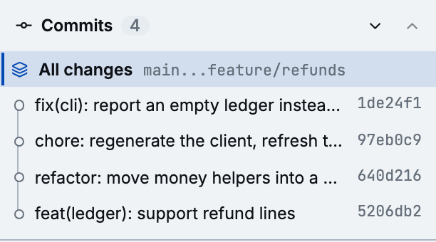

When a comparison spans several commits, the **Commits** box at the top of the panel lists them,
newest first, under an **All changes** entry for the whole range.

## Focus a commit

Click a commit to see its diff alone, against its parent. The list stays the same, so you can move
on to the next commit without losing your place:

- `<` and `>` step to the older or newer commit;
- **All changes** returns to the whole range.

The focused commit is highlighted and shows its full message. Hover over another commit to see its
message in a card. Click a hash to copy it.

Ranges with more than five commits start with the box collapsed so the threads keep their room;
click **Commits** to open it.

## Comments on a focused commit

Comments you leave while a commit is focused belong to that commit, exactly as if you had opened it
with `diffle show <commit>`. They don't appear on the whole range, and comments on the range don't
appear on the commit. The prompt and a GitHub export always use the comments of what is shown.

## Within an iteration comparison

When you [compare two iterations](./iterations.md), the box pairs the two iterations' commits the
way `git range-diff` does. Each pair is marked:

- **identical**: the same patch in both iterations;
- **reworded**: the same patch with a new message;
- **amended**: the patch changed;
- **added** or **dropped**: the commit exists in only one iteration.

Click an added, amended, or reworded pair to see that one commit: an added commit against its
parent, an amended or reworded one against its older version. **Since #n** returns to the whole
iteration comparison.
