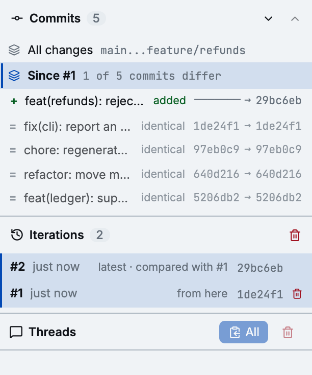
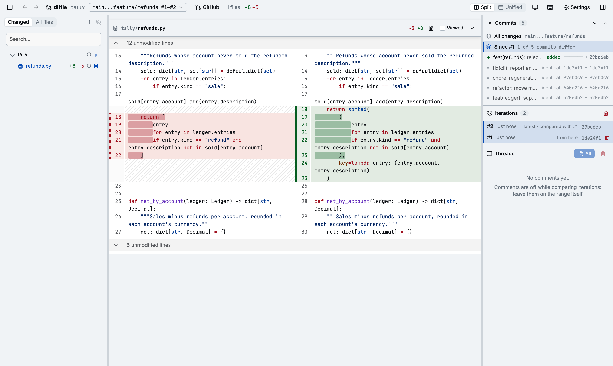

You review a branch, the author pushes fixes, and you want to see the fixes, not the whole branch
again. Iterations answer that.

## What an iteration is

An iteration is one state of a range: the two commits its ends pointed to when diffle loaded it.
Whenever diffle loads the range and either end has moved (a push, a rebase, an amend), it records
the next iteration.

diffle records iterations for ranges that can move again: comparisons between refs, and pull
requests. A worktree review or a single commit has none. diffle keeps the newest 50 iterations of
each range and pins their commits under `refs/diffle/iterations/`, so a force-push or a
garbage collection can't take away what you reviewed.

## Compare iterations

Once a range has two iterations, the **Iterations** box appears in the panel, newest first. The
newest is the range as it stands.

Click an older iteration to compare it with the latest. The header then reads, for example,
`main...feature/refunds #1→#2`, and the diff shows only what the branch itself changed in between.
Commits that arrived from the base branch through a rebase don't show up: diffle replays the older
iteration onto the newer base before it compares them.

With two iterations compared, a plain click sets the older end and a shift-click the newer one, so
you can compare any two. From the keyboard:

| Keys                 | Action                                                                   |
| -------------------- | ------------------------------------------------------------------------ |
| `ii`                 | The latest iteration against the one before it; again, back to the range |
| `i`, then `1` to `9` | That iteration against the latest                                        |
| `ij` / `ik`          | Move the older end one iteration back / forward                          |
| `iJ` / `iK`          | Move the newer end one iteration back / forward                          |

The [Commits](./commits.md#within-an-iteration-comparison) box shows how the commits pair up
between the two iterations.

Comments are off while you compare iterations: leave them on the range itself, where they follow
the code into each new iteration.

## Forget iterations

The trash icon on an older iteration forgets it. The one in the box's header forgets them all, and
the range's current state starts again as `#1`. Forgetting an iteration also unpins its commits.
