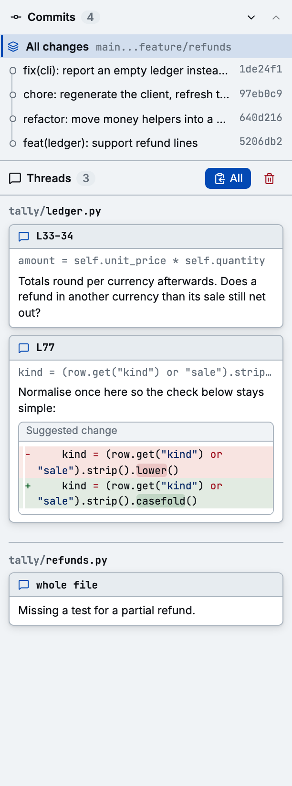

A thread is a comment on a line, a block of lines, or a whole file, plus its replies.

## Start a thread

- **A line**: put the cursor on it and press `c`, or click its line number.
- **A block**: drag across line numbers, or press `V` and extend the selection with `j` and `k`,
  then `c`.
- **A file**: press `C`, or use the comment icon in the file's header.

You can comment on both sides of a split diff. A comment on a removed line is marked `(removed)` in
the prompt.

Comments are Markdown. **Suggest change** adds a `suggestion` block prefilled with the selected
lines. Edit it into the code you want; the thread then shows the change as a diff.

## Work with threads

Every thread shows inline in the diff and in the **Threads** list of the panel, grouped by file.
Click one in the list to jump to it.

| Keys      | Action                                                  |
| --------- | ------------------------------------------------------- |
| `e`       | Edit the newest message of the thread under the cursor  |
| `R`       | Resolve or reopen the thread                            |
| `dd`      | Delete the thread                                       |
| `yy`, `Y` | Copy all open threads as a [prompt](./agent-handoff.md) |

Each card also has buttons to copy, edit, reply, resolve, and delete. Resolved threads are kept but
hidden from the list; tick **Show resolved** to see them. They are left out of the prompt and of
**Add all** on GitHub.

## Threads follow the code

diffle stores the text each thread was anchored to. When the diff changes (you edit the file, a ref
moves, you reload), every thread looks for its text again, near where it was, and moves with it.

A thread whose text is gone, or no longer inside the diff, becomes **stale**. Stale threads show
with a dashed border and stay in the list until you delete them; the list's **Delete** button next
to the stale count removes them all. The prompt still includes them, marked
`(stale, was line 33)`, but they can't be added to a GitHub review.

## Where comments live

Comments are stored per comparison in `<git-dir>/diffle/comments.json` and never touch your
worktree. Open the same comparison again, even weeks later, and your threads are back. A
[focused commit](./commits.md#comments-on-a-focused-commit) keeps its own threads.

## Viewed files

`v` marks the current file viewed: it collapses, and the cursor moves on to the next unviewed file.
`gv` toggles the file above. Viewed marks are saved with the comments.

If a file changes after you marked it viewed, diffle unmarks it and flags it **changed since
viewed**.

Generated files start collapsed, as on GitHub: `linguist-generated` in `.gitattributes` marks them,
and `linguist-generated=false` opts a file out. To start other files as viewed, add
[auto-viewed patterns](../reference/configuration.md#auto-viewed-patterns).
