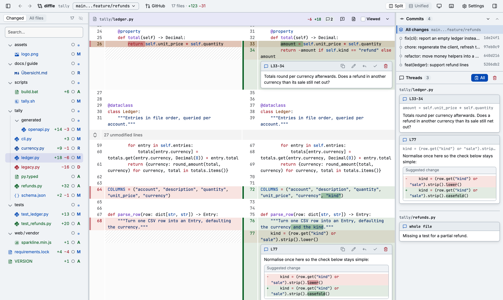

diffle reviews a Git diff in your browser. You read the changes, leave comments on lines, blocks,
or whole files, and then hand those comments on:

- **to an agent** as a prompt: printed when you close the tab, or copied with `yy`;
- **to GitHub** as a pending review that you finish and submit there.

Everything runs locally. diffle reads your repository through `git`, never changes your worktree,
and keeps its own state under `<git-dir>/diffle/`.

The window has three columns:

- **File tree** (left): the changed files with their status and line counts, and a viewed toggle
  for each one. **All files** shows the whole tree at the new side.
- **Diff** (middle): one file after another, split or unified, with comment threads inline.
- **Panel** (right): the [commits](./guides/commits.md) of the range, its
  [iterations](./guides/iterations.md) once it has moved, and every [thread](./guides/threads.md).

Start with [Getting started](./getting-started.md).
