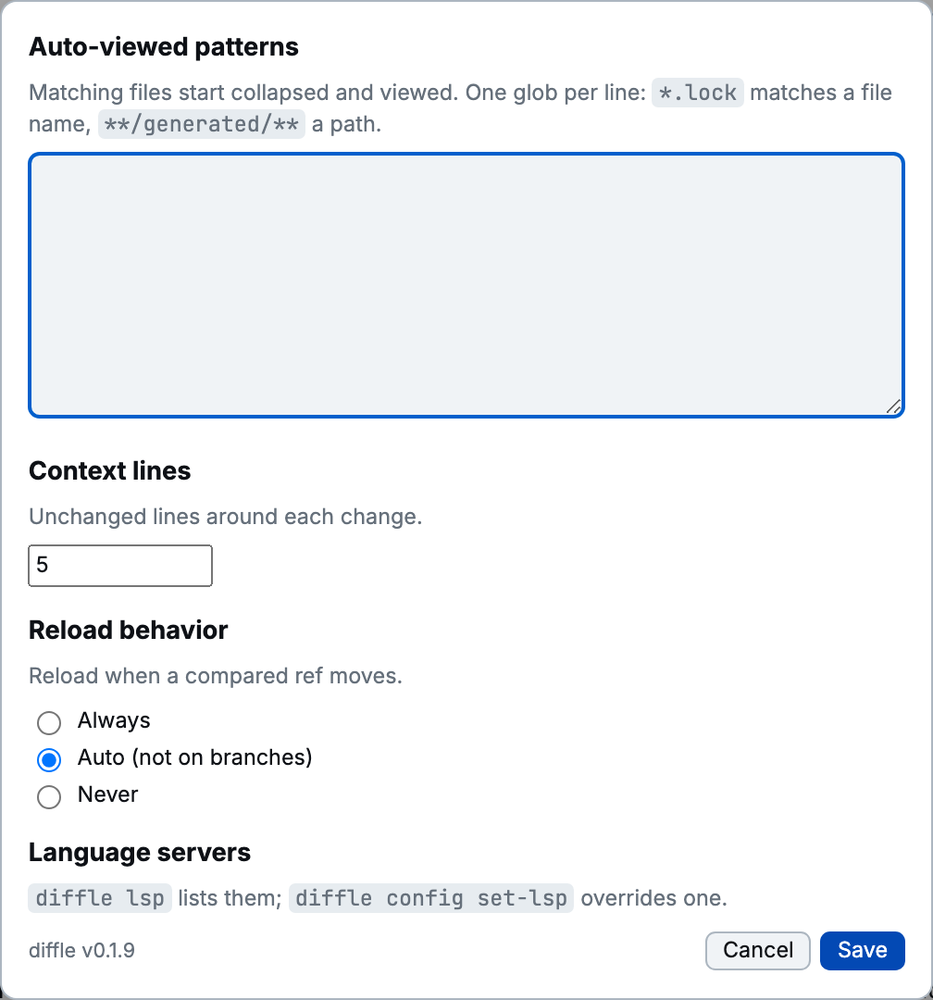

diffle has one user config for the whole machine, at `$XDG_CONFIG_HOME/diffle/config.json`, or
`~/.config/diffle/config.json` when `XDG_CONFIG_HOME` is unset. Change it in the **Settings** dialog
or with [`diffle config`](./cli.md#diffle-config); `diffle config show` prints its path and
contents.



```json
{
  "autoViewed": ["*.lock", "**/generated/**"],
  "contextLines": 5,
  "followRefs": "auto",
  "lspCommands": { "rust": "rust-analyzer", "java": "" }
}
```

## Auto-viewed patterns

`autoViewed`: globs for files that start viewed and collapsed. `*.lock` matches a file name, and
`**/generated/**` a path. Empty by default.

```bash
diffle config add-auto-viewed '*.lock' '**/generated/**'
diffle config remove-auto-viewed '*.lock'
diffle working --auto-viewed '*.snap'      # this run only
```

Files marked `linguist-generated` in `.gitattributes` start collapsed without a pattern.

## Context lines

`contextLines`: unchanged lines shown around each change, like `git diff -U`. Default 5.

```bash
diffle config set-context 10
diffle working -U 20                       # this run only
```

## Reload behavior

`followRefs`: what happens when a ref of a comparison between refs moves. See
[When the compared refs move](../guides/choosing-a-comparison.md#when-the-compared-refs-move).

| Value  | In Settings            | Behavior                                                                  |
| ------ | ---------------------- | ------------------------------------------------------------------------- |
| `on`   | Always                 | Recompute at once                                                         |
| `auto` | Auto (not on branches) | Wait for Reload when an endpoint is a branch; recompute at once otherwise |
| `off`  | Never                  | Always wait for Reload                                                    |

```bash
diffle config set-follow-refs off
```

## Language servers

`lspCommands`: a command per language, replacing the built-in choice. An empty string turns the
language off. Set these with `diffle config set-lsp`; the Settings dialog only points to them. See
[Code navigation](../guides/code-navigation.md#override-a-server).

diffle writes the file with owner-only permissions because it can hold shell commands.
