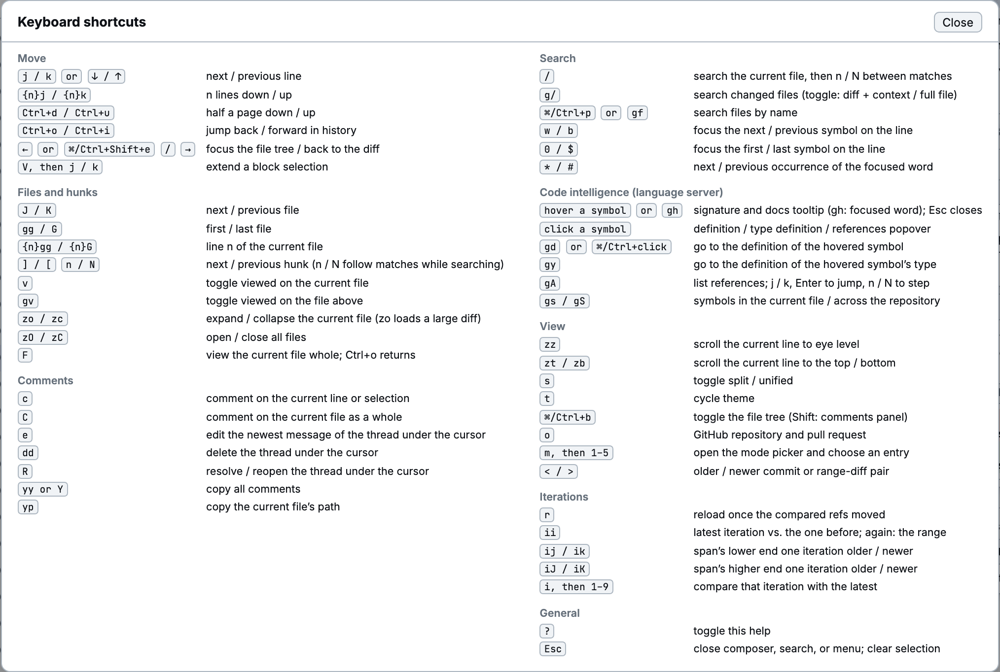

Press `?` in diffle for this list. Keys are case-sensitive: `J` means Shift+j. A number before a
motion repeats it or picks a line, as in Vim.

## Move

| Keys                        | Action                                 |
| --------------------------- | -------------------------------------- |
| `j` / `k`, or `↓` / `↑`     | Next / previous line                   |
| `{n}j` / `{n}k`             | `n` lines down / up                    |
| `Ctrl+d` / `Ctrl+u`         | Half a page down / up                  |
| `Ctrl+o` / `Ctrl+i`         | Jump back / forward in history         |
| `←` or ⌘/Ctrl+Shift+e / `→` | Focus the file tree / back to the diff |
| `V`, then `j` / `k`         | Extend a block selection               |

## Files and hunks

| Keys             | Action                                                       |
| ---------------- | ------------------------------------------------------------ |
| `J` / `K`        | Next / previous file                                         |
| `gg` / `G`       | First / last file                                            |
| `{n}gg` / `{n}G` | Line `n` of the current file                                 |
| `]` / `[`        | Next / previous hunk                                         |
| `n` / `N`        | Next / previous hunk; while searching, next / previous match |
| `v`              | Toggle viewed on the current file                            |
| `gv`             | Toggle viewed on the file above                              |
| `zo` / `zc`      | Expand / collapse the current file (`zo` loads a large diff) |
| `zO` / `zC`      | Expand / collapse all files                                  |
| `F`              | View the current file whole; `Ctrl+o` returns                |

## Comments

| Keys        | Action                                                 |
| ----------- | ------------------------------------------------------ |
| `c`         | Comment on the current line or selection               |
| `C`         | Comment on the current file as a whole                 |
| `e`         | Edit the newest message of the thread under the cursor |
| `dd`        | Delete the thread under the cursor                     |
| `R`         | Resolve / reopen the thread under the cursor           |
| `yy` or `Y` | Copy all open threads as a prompt                      |
| `yp`        | Copy the current file's path                           |

## Search

| Keys              | Action                                                             |
| ----------------- | ------------------------------------------------------------------ |
| `/`               | Search the current file; `n` / `N` step between matches            |
| `g/`              | Search all changed files (toggle: diff and context, or full files) |
| ⌘/Ctrl+p, or `gf` | Find a file by name                                                |
| `w` / `b`         | Focus the next / previous symbol on the line                       |
| `0` / `$`         | Focus the first / last symbol on the line                          |
| `*` / `#`         | Next / previous occurrence of the focused word                     |

## Code navigation

These need a [language server](../guides/code-navigation.md).

| Keys                    | Action                                                       |
| ----------------------- | ------------------------------------------------------------ |
| Hover a symbol, or `gh` | Signature and docs (`gh`: the focused word); `Esc` closes    |
| Click a symbol          | Definition / type definition / references popover            |
| `gd`, or ⌘/Ctrl+click   | Go to the definition                                         |
| `gy`                    | Go to the definition of the symbol's type                    |
| `gA`                    | List references: `j` / `k`, Enter to jump, `n` / `N` to step |
| `gs` / `gS`             | Symbols in the current file / across the repository          |

## View

| Keys              | Action                                                                                              |
| ----------------- | --------------------------------------------------------------------------------------------------- |
| `zz`              | Scroll the current line to eye level                                                                |
| `zt` / `zb`       | Scroll the current line to the top / bottom                                                         |
| `s`               | Toggle split / unified                                                                              |
| `t`               | Cycle the theme                                                                                     |
| ⌘/Ctrl+b          | Toggle the file tree                                                                                |
| ⌘/Ctrl+Shift+b    | Toggle the comments panel                                                                           |
| `o`               | GitHub repository and pull request                                                                  |
| `m`, then `1`–`5` | Open the [mode picker](../guides/choosing-a-comparison.md#with-the-mode-picker) and choose an entry |
| `<` / `>`         | Older / newer [commit](../guides/commits.md), or range-diff pair                                    |

## Iterations

| Keys              | Action                                                    |
| ----------------- | --------------------------------------------------------- |
| `r`               | Reload once the compared refs moved                       |
| `ii`              | Latest iteration against the one before; again, the range |
| `ij` / `ik`       | Move the older end one iteration back / forward           |
| `iJ` / `iK`       | Move the newer end one iteration back / forward           |
| `i`, then `1`–`9` | Compare that iteration with the latest                    |

## General

| Keys  | Action                                                   |
| ----- | -------------------------------------------------------- |
| `?`   | Toggle the shortcut list                                 |
| `Esc` | Close the composer, search, or menu; clear the selection |

In the **Two refs…** pane of the mode picker, `x` swaps the refs and Space toggles **Merge base** and
**Direct**.
